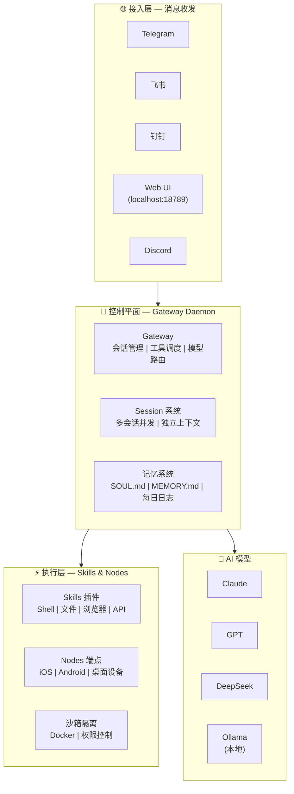

# OpenClaw 完全指南：从安装到最佳实践

想象一下这样的场景：你对着手机说了一句"帮我把桌面上的 PDF 按日期归档，然后把这周的会议纪要整理成一封邮件发给团队"——几秒钟后，你的电脑真的开始自己动手了。文件在 Finder 里自动移动，邮件客户端弹出一封排版整齐的草稿。这不是科幻电影，这是 OpenClaw 正在做的事。

## 不只是聊天，而是真正动手

你可能已经用过 ChatGPT、Claude 或文心一言。它们很聪明，能写文章、回答问题、翻译代码。但有一个根本性的限制——**它们只能"说"，不能"做"**。你让 ChatGPT 帮你整理文件，它会告诉你怎么做，但不会真的动手。

OpenClaw 不一样。它是一个**开源的、本地优先的 AI Agent 框架**，运行在你自己的电脑或服务器上。它不仅能理解你的意图，还能直接操作文件系统、执行 Shell 命令、控制浏览器、对接消息平台。简单来说：**ChatGPT 是你的顾问，OpenClaw 是你的助手。**

## 从龙虾到开源传奇

OpenClaw 的故事颇具戏剧性。2025 年 11 月，奥地利开发者 Peter Steinberger（PSPDFKit 前 CEO，后加入 OpenAI）发布了一个叫 **Clawdbot** 的项目——名字取自 "Claude" 的谐音，吉祥物是一只龙虾。项目一上线就火了，GitHub Star 在短短数月内从 9000 飙升到 11 万。

然后 Anthropic 找上门来，友好地指出 "Clawd" 涉嫌商标侵权。Peter 仓促改名为 "Moltbot"（龙虾蜕壳之意），结果**仅 3 天**就发现 Moltbot 的社交媒体账号已被加密货币诈骗者抢注，品牌安全无法保障。于是在 2026 年 1 月 30 日，经过充分准备——专业商标检索、域名购买、迁移脚本——项目正式更名为 **OpenClaw**。"Open"代表开源，"Claw"保留龙虾主题。

如今，OpenClaw 在 GitHub 上拥有超过 **310K Star**，2026 年 3 月甚至超过了 React，成为 GitHub 上最多 Star 的软件项目之一。清华大学沈阳教授团队还为它发布了《OpenClaw 开源 AI Agent 框架技术分析报告》。

## 核心价值：你的助手，你的机器，你说了算

OpenClaw 的哲学可以用一句话概括：**本地优先，数据不出门**。你的文件、对话、API Key 都留在自己的设备上，不经过任何第三方服务器。这对注重隐私的个人用户和有合规要求的企业来说，是一个巨大的吸引力。

## 本文导航

这篇指南将带你走完 OpenClaw 的完整旅程：

| 章节 | 你将学到 |
|------|---------|
| **架构解析** | OpenClaw 的内部结构和设计哲学 |
| **安装实战** | 在 macOS / Linux / Windows 上手把手安装 |
| **首次配置** | 接入 AI 模型和消息平台 |
| **日常使用** | 核心命令、工作区、记忆系统 |
| **Skill 扩展** | 安装和开发自定义技能包 |
| **国内生态** | DeepSeek/Qwen 配置、飞书/钉钉接入 |
| **企业部署** | 多用户管理、安全加固 |
| **性能调优** | 模型路由、成本控制、故障排查 |
| **总结展望** | 适用场景、社区资源、未来路线 |

无论你是想在自己电脑上试玩的新手，还是评估企业级方案的技术负责人，都能在这篇指南里找到你需要的答案。

在动手安装之前，让我们先花 5 分钟了解 OpenClaw 的内部架构——理解它是怎么工作的，会让你后面的每一步都更有信心。

---

## 架构解析 — 三层架构与核心组件

如果把 OpenClaw 比作一家公司，那它有三个"部门"：前台接待（接入层）、核心管理层（控制平面）和执行团队（执行层）。理解这三层，你就理解了 OpenClaw 的一切。

### 三层架构总览



*图 1：OpenClaw 三层架构概览。消息从接入层进入，经 Gateway 调度后，由执行层完成实际操作。*

### 接入层：你和 AI 之间的桥梁

接入层负责统一各种消息渠道。无论你从 Telegram 发消息、用飞书 @机器人、还是打开浏览器访问 Web UI，OpenClaw 都会把你的指令转换成统一的内部格式。这意味着**你只需要部署一次，就能同时在多个平台上使用**。

### 控制平面：系统的"大管家"

**Gateway Daemon** 是 OpenClaw 的核心，运行在 `localhost:18789`，通过 WebSocket 协议与各组件通信。它做三件关键的事：

1. **会话管理**：每个对话都是一个独立的 Session，有自己的上下文和记忆。你可以同时开多个会话，互不干扰。
2. **工具调度**：收到你的指令后，Gateway 决定调用哪些 Skills（工具）来完成任务，像一个项目经理分配工作。
3. **模型路由**：根据任务复杂度选择最合适的 AI 模型——简单问答用便宜快速的模型，复杂推理用高端模型，帮你省钱。

### 执行层：真正干活的团队

执行层包含两类组件：

- **Skills（技能插件）**：用 JavaScript/TypeScript 编写的工具包，覆盖 Shell 命令执行、文件读写、浏览器自动化、API 调用等。社区已有超过 13000 个可用 Skill。
- **Nodes（设备端点）**：运行在 iOS/Android 等设备上的轻量客户端，暴露摄像头、屏幕、位置等硬件能力给 Agent 使用。

执行层还内置了**沙箱隔离**机制：高危操作（如删除文件、执行系统命令）需要通过权限审批，防止 AI "误操作"。

### 灵魂三件套：让 AI 记住你

OpenClaw 的记忆系统是它区别于大多数 AI 工具的独特设计：

| 文件 | 作用 | 类比 |
|------|------|------|
| **SOUL.md** | 定义 AI 的人格、语气、行为边界 | AI 的"性格说明书" |
| **USER.md** | 记录用户信息、偏好、习惯 | AI 对你的"用户画像" |
| **MEMORY.md** | 存储长期记忆和重要事项 | AI 的"笔记本" |
| **memory/*.md** | 每日日志，自动追加 | AI 的"日记" |

SOUL.md 的结构分四部分：身份（你叫什么、服务谁）、沟通风格（正式还是随意）、核心规则（绝对不做什么）、领域知识（你懂什么技术）。通过精心配置这些文件，你的 OpenClaw 会**越用越懂你**。

### 与同类产品对比

对于正在做技术选型的读者，这张表可以帮你快速决策：

| 维度 | OpenClaw | ChatGPT | Auto-GPT |
|------|----------|---------|----------|
| **运行位置** | 本地设备 / 自建服务器 | OpenAI 云端 | 本地运行 |
| **核心能力** | 理解 + 执行操作 | 理解 + 文本回复 | 理解 + 自主任务循环 |
| **数据隐私** | 数据不出本机 | 数据经过 OpenAI 服务器 | 数据在本地 |
| **多平台接入** | ✅ 飞书/Telegram/钉钉等 | ❌ 仅网页/API | ❌ 仅命令行 |
| **Skill 扩展** | ✅ 13000+ 社区插件 | ❌ 有限的 GPTs | ⚠️ 社区较小 |
| **企业就绪** | ✅ RBAC/审计/多租户 | ⚠️ 企业版另付费 | ❌ 无企业功能 |
| **成本** | 开源免费 + 模型 API 费 | 订阅制 $20/月起 | 开源 + 模型 API 费 |

核心逻辑闭环可以用一句话概括：**意图解析 → 任务规划 → 工具调用 → 结果反馈**。OpenClaw 不是一个"聊天机器人"，而是一个能闭环执行任务的 AI Agent 系统。

架构搞清楚了，接下来动手——让我们把 OpenClaw 装到你的电脑上。

---

## 安装实战 — 全平台手把手安装

装软件这件事，要么一帆风顺，要么踩坑到怀疑人生。好消息是，OpenClaw 的安装已经做得相当友好——大多数情况下，一行命令就搞定。

### 系统要求

在开始之前，确认你的设备满足以下条件：

| 要求 | 最低配置 | 推荐配置 |
|------|---------|---------|
| **操作系统** | macOS 12+ / Ubuntu 20.04+ / Windows 10 (WSL2) | macOS 14+ / Ubuntu 22.04+ |
| **Node.js** | v22.16+ (LTS) | v24（最新稳定版） |
| **内存** | 4 GB | 8 GB+（运行本地模型需 16 GB+） |
| **磁盘空间** | 2 GB | 5 GB+（含本地模型缓存） |
| **网络** | 需要访问 AI 模型 API | 国内用户可用 DeepSeek/Qwen，无需 VPN |

> 💡 **小贴士**：如果你打算在云服务器上安装，建议使用**干净的 OS 镜像**，避免使用预装各种面板的"一键镜像"——它们可能导致端口冲突或依赖版本不匹配。

### 方式一：一键脚本安装（推荐）

这是最简单的方式，脚本会自动检测你的系统环境并完成安装。

**macOS / Linux / WSL2：**

```bash
$ curl -fsSL https://openclaw.ai/install.sh | bash
# ... 安装输出 ...
# ✅ OpenClaw installed successfully!
# Run 'openclaw onboard' to get started.
```

**Windows PowerShell（管理员模式）：**

```powershell
$ iwr -useb https://openclaw.ai/install.ps1 | iex
# ✅ OpenClaw installed successfully!
```

**🇨🇳 中国用户加速版：**

如果你在国内网络环境下，使用社区提供的加速安装脚本，速度会快很多：

```bash
$ curl -fsSL https://open-claw.org.cn/install-cn.sh | bash
# 使用 npmmirror 镜像，国内下载速度拉满
```

### 方式二：npm / pnpm 手动安装

如果你已经有 Node.js 环境，可以用包管理器安装：

```bash
# 国内用户先配置镜像加速
$ npm config set registry https://registry.npmmirror.com

# 使用 npm 安装
$ npm install -g openclaw@latest
$ openclaw onboard --install-daemon
# ✅ Gateway daemon installed and started.

# 或者使用 pnpm（推荐，速度更快）
$ pnpm add -g openclaw@latest
$ pnpm approve-builds -g        # pnpm 需要额外批准构建脚本
$ openclaw onboard --install-daemon
```

### 方式三：从源码构建

适合想深入了解代码或参与贡献的开发者：

```bash
# 使用国内 Gitee 镜像克隆（速度快）
$ git clone https://gitee.com/OpenClaw-CN/openclaw-cn.git
$ cd openclaw-cn

# 配置镜像并安装依赖
$ pnpm config set registry https://registry.npmmirror.com/
$ pnpm install
$ pnpm ui:build
$ pnpm build

# 链接到全局命令
$ pnpm link --global
$ openclaw onboard --install-daemon
```

### 方式四：Docker 部署

适合服务器部署或想要环境隔离的场景：

```bash
$ git clone https://github.com/openclaw/openclaw.git
$ cd openclaw
$ ./docker-setup.sh
# Docker 会拉取镜像并启动所有服务
# 访问 http://localhost:18789 打开 Web UI
```

### 安装后验证：三步确认

选好了安装方式？不管用哪种，完成后都跑这三个命令确认一切正常：

```bash
# 第一步：健康检查——找出配置问题
$ openclaw doctor
✅ Node.js version: v24.0.0
✅ Gateway daemon: running
✅ Config file: valid
⚠️ No AI model configured (run 'openclaw onboard' to set up)

# 第二步：查看网关状态
$ openclaw status
Gateway: running on localhost:18789
Uptime: 2 minutes
Sessions: 0 active

# 第三步：打开浏览器管理界面
$ openclaw dashboard
# 浏览器自动打开 http://127.0.0.1:18789/
```

### 常见安装问题

即使是一键安装，也有几个"经典坑"值得提前了解：

**❌ 问题 1："openclaw: command not found"**

这是最常见的安装后问题。原因是 npm 全局安装路径没有加入系统 PATH。

```bash
# 查看 npm 全局路径
$ npm prefix -g
/usr/local

# 将路径加入你的 shell 配置文件
$ echo 'export PATH="$(npm prefix -g)/bin:$PATH"' >> ~/.zshrc
$ source ~/.zshrc

# 或者对于 bash 用户
$ echo 'export PATH="$(npm prefix -g)/bin:$PATH"' >> ~/.bashrc
$ source ~/.bashrc
```

**❌ 问题 2：Sharp 模块构建失败**

Sharp 是一个图像处理库，某些系统上构建会报错：

```bash
# 跳过全局 libvips 检查，使用内置版本
$ SHARP_IGNORE_GLOBAL_LIBVIPS=1 npm install -g openclaw@latest
```

**❌ 问题 3：pnpm 安装后无法运行**

pnpm 默认不自动执行构建脚本，需要手动批准：

```bash
$ pnpm approve-builds -g
# 批准 openclaw 的构建脚本后重新安装
```

> ⚠️ **Windows 用户特别提示**：强烈推荐使用 **WSL2（Windows Subsystem for Linux）** 来安装。原生 PowerShell 安装虽然可行，但在依赖管理和 Shell 命令兼容性方面会遇到更多问题。WSL2 + Ubuntu 是 Windows 上体验最好的方案。

OpenClaw 已经装好了！但它现在还是个"空壳"——接下来我们给它接上大脑（AI 模型）和耳朵（消息平台）。

---

## 首次配置 — 模型、密钥与消息平台

如果说安装是给 OpenClaw 搭好了身体，那配置就是给它装上大脑和五官。这一步决定了它有多聪明、能听到谁的指令、以及在哪里回复你。

### 交互式配置向导

首次安装完成后，运行配置向导：

```bash
$ openclaw onboard --install-daemon
```

向导会引导你完成三个核心设置：
1. 选择 AI 模型提供商
2. 输入 API Key
3. 选择消息渠道（Telegram / Discord / Web UI / 飞书等）

整个过程大约 3 分钟。如果你对某些选项不确定，别担心——后面都可以在配置文件里修改。

### AI 模型选择指南

这是最关键的一步。不同的模型各有所长，选择取决于你的使用场景和预算：

| 模型 | 提供商 | 上下文窗口 | 优势 | 适合场景 | 国内可用 |
|------|--------|-----------|------|---------|---------|
| **Claude Sonnet/Opus** | Anthropic | 200K token | 长文本理解、指令遵循 | 复杂分析、长文写作 | 需代理 |
| **GPT-4o / Codex** | OpenAI | 128K token | 生态完善、代码能力强 | 编程、API 调用 | 需代理 |
| **Gemini Pro** | Google | 1M token | 超大上下文、多模态 | 多文件分析、图片理解 | 需代理 |
| **DeepSeek V3** | DeepSeek | 128K token | 性价比极高、中文优秀 | 国内首选、日常对话 | ✅ 直连 |
| **Qwen 3.5** | 阿里云 | 128K token | 每天100万免费token | 预算有限、轻量任务 | ✅ 直连 |
| **Ollama 本地** | 本地运行 | 取决于模型 | 完全免费、隐私最优 | 离线场景、敏感数据 | ✅ 本地 |

> 💡 **国内用户推荐路径**：先用 DeepSeek V3（注册即送免费额度，支持支付宝充值），体验满意后再考虑是否需要 Claude 或 GPT。

### 配置 API Key

以最推荐的 DeepSeek 为例，完整配置步骤：

**第一步：获取 API Key**

前往 [platform.deepseek.com](https://platform.deepseek.com) 注册账号，在控制台创建 API Key。新用户会获得免费额度，足够你体验一周。

**第二步：通过向导配置**

```bash
$ openclaw onboard
# → Select AI Provider: DeepSeek (Recommended for CN)
# → Enter API Key: sk-你的Key
# → ✅ Model configured successfully!
```

**第三步：手动配置（可选）**

如果你更喜欢直接编辑配置文件：

```json
// ~/.openclaw/openclaw.json（注：实际 JSON 不支持注释，此处仅为说明）
{
  "auth": {
    "profiles": {
      "deepseek:default": {
        "provider": "deepseek",
        "mode": "api_key",
        "apiKey": "sk-你的Key"
      }
    }
  },
  "agents": {
    "defaults": {
      "model": {
        "primary": "deepseek/deepseek-chat"
      }
    }
  }
}
```

如果你想用 **Qwen（通义千问）**，使用 OpenAI 兼容模式接入：

```bash
$ openclaw onboard
# → Select AI Provider: Custom OpenAI Compatible
# → API Key: 你的 Qwen API Key
# → Base URL: https://dashscope.aliyuncs.com/compatible-mode/v1
```

### 🔴 安全第一：必须设置访问密码

这一步**绝对不能跳过**。2026 年初，安全研究机构发现互联网上有超过 **13.5 万个 OpenClaw 实例** 暴露在公网且未设密码，其中超过 **3 万个实例在 72 小时内被攻陷**——攻击者可以通过它们执行任意命令、窃取文件。

```bash
# 设置访问密码（必做！）
$ openclaw config set auth.password "你的强密码"

# 安全审计——检查是否还有暴露风险
$ openclaw security audit
✅ Password: set
✅ allowFrom: configured
⚠️ Gateway exposed on 0.0.0.0 — recommend binding to 127.0.0.1
```

> 🔴 **永远不要将 auth 设为 "none"**。即使只是在本地测试，也应该设置密码。养成好习惯，不给攻击者可乘之机。

### 连接消息平台

配置好模型后，你需要选择通过哪个渠道跟 OpenClaw 对话。以最简单的 **Telegram** 为例：

**1. 创建 Telegram Bot**
在 Telegram 中搜索 `@BotFather`，发送 `/newbot`，按提示创建机器人并获取 Token。

**2. 配置 Bot Token**
```bash
$ openclaw config set telegram.botToken "你的Bot-Token"
$ openclaw gateway restart
# ✅ Telegram channel connected!
```

**3. 验证连接**
在 Telegram 里给你的 Bot 发一条消息，如果它回复了，说明一切正常！

当然，你也可以直接使用 **Web Control UI**——打开浏览器访问 `http://127.0.0.1:18789/`，无需任何额外配置就能开始对话。

### 配置文件目录结构

了解配置文件放在哪里，后续排查问题会方便很多：

```
~/.openclaw/
├── openclaw.json      # 主配置文件（模型、密钥、安全设置）
├── workspace/
│   ├── skills/        # 已安装的 Skill
│   ├── agents/        # Agent 配置
│   ├── memory/        # 每日记忆日志
│   ├── MEMORY.md      # 长期记忆
│   ├── SOUL.md        # AI 人格设定
│   └── USER.md        # 用户信息
└── logs/
    └── gateway.log    # 网关运行日志
```

配置完成，你的 OpenClaw 已经"活"过来了！接下来，让我们看看日常工作中怎么跟它高效协作。

---

## 日常使用 — 核心命令与工作区管理

学会了安装和配置，你现在手里有了一把"瑞士军刀"。但如果只用它来开罐头，未免太可惜了。这一节带你熟悉 OpenClaw 的核心操作，让它真正融入你的日常工作流。

### 命令速查表

先来一张"作弊卡"，把最常用的命令列在这里，建议收藏：

| 命令 | 功能 | 使用频率 |
|------|------|---------|
| `openclaw gateway start` | 启动网关服务 | 每天一次 |
| `openclaw gateway restart` | 重启网关（配置修改后） | 偶尔 |
| `openclaw gateway stop` | 停止网关 | 需要时 |
| `openclaw status` | 查看网关运行状态 | 排查问题时 |
| `openclaw dashboard` | 打开 Web 管理界面 | 常用 |
| `openclaw doctor` | 健康检查——找出配置问题 | 安装后/出问题时 |
| `openclaw config` | 查看和修改配置 | 偶尔 |
| `openclaw sessions list` | 查看当前活跃会话 | 调试时 |
| `openclaw sessions history` | 查看工具调用历史 | 调试时 |
| `openclaw skills list` | 列出已安装的 Skill | 管理时 |
| `openclaw security audit` | 安全审计检查 | 定期 |

> 💡 **记不住没关系**，输入 `openclaw --help` 就能看到完整的命令列表和用法说明。

### 工作区：OpenClaw 的"办公室"

OpenClaw 的所有工作数据都存放在 **工作区（Workspace）** 中，默认路径是 `~/.openclaw/workspace/`。理解工作区结构，是高效使用的基础。

还记得架构解析中提到的"灵魂三件套"吗？这里来详细看看怎么配置和使用它们。

**🧠 MEMORY.md — 长期记忆**

这是 OpenClaw 的"记事本"。每次会话结束后，它会自动记录重要信息——你的偏好、常用项目路径、之前交代过的规则等。下次对话时，它会先读取这个文件，这就是为什么用得越久，它越"懂你"。

```markdown
# Memory

## 用户偏好
- 代码风格偏好 TypeScript，使用 ESLint + Prettier
- 部署首选 Docker，生产环境用 k8s
- 沟通语言：中文为主，技术术语用英文

## 项目信息
- 主项目路径：~/projects/my-saas-app
- 技术栈：Next.js + Prisma + PostgreSQL
```

**👻 SOUL.md — 人格设定**

如果说 MEMORY.md 是"知道什么"，SOUL.md 就是"是什么样的人"。你可以通过它定义 AI 的身份、语气和行为边界。

```markdown
# Soul

## 身份
你是一个资深全栈工程师，专注于 Web 开发和 DevOps。

## 沟通风格
- 简洁直接，不说废话
- 先给解决方案，再解释原因
- 代码注释用中文

## 不可违反的规则
- 永远不要未经确认就删除文件
- 生产环境操作前必须二次确认
- 不要直接暴露 API Key 到代码中
```

**👤 USER.md — 用户画像**

记录你的基本信息，帮助 AI 更好地理解上下文。比如你的职业、技术水平、时区等。

**📅 memory/ 目录 — 每日日志**

除了 MEMORY.md，OpenClaw 还会在 `memory/` 目录下自动生成每日日志文件（格式：`YYYY-MM-DD.md`），记录当天的交互摘要。这些日志是只追加的，不会修改历史内容。

### 实战场景：三个递进示例

光看命令不过瘾，来几个实际场景感受一下 OpenClaw 的能力：

**场景一：整理下载文件夹（简单）**

直接在 Telegram 或 Web UI 中发消息：

> "帮我整理 ~/Downloads 文件夹：把图片移到 ~/Pictures，文档移到 ~/Documents，压缩包移到 ~/Archives，超过 30 天的临时文件删除。"

OpenClaw 会自动扫描文件、分类、移动，并给你一份操作报告。整个过程你只需要发一条消息。

**场景二：自动化部署（中等）**

> "帮我把 ~/projects/my-app 用 Docker 部署到测试服务器 192.168.1.100，端口映射 3000:3000，挂载 ./data 目录。"

OpenClaw 会生成 Dockerfile（如果没有的话）、构建镜像、通过 SSH 推送到服务器、启动容器，然后汇报部署状态。

**场景三：竞品信息搜集（高级）**

> "搜集最近一周关于 AI 编程助手的新闻，整理成一份竞品分析表格，包含产品名、最新动态、核心功能、定价变化。保存为 Excel 文件。"

OpenClaw 会调用浏览器工具搜索信息、提取关键数据、整理成结构化表格，最后生成 Excel 文件。这个任务可能需要几分钟，但全程无需你操心。

### 让 AI 越用越懂你

记忆系统是 OpenClaw 最有温度的设计之一。除了自动记录，你也可以主动"教"它：

> "记住：我的 MySQL 数据库密码统一存放在 1Password 的'服务器密码'条目里，不要在命令行里直接输入密码。"

下次你让它操作数据库时，它会自动提醒你从 1Password 获取密码，而不是傻乎乎地问你"请输入密码"。

掌握了基础用法后，你可能会想：能不能教 OpenClaw 学会更多技能？答案是——当然可以。

---

## Skill 扩展 — 安装社区 Skill + 自定义开发

如果说 OpenClaw 本体是一台"万能机器人"，那 Skill 就是它的"技能包"。装上不同的 Skill，它就会不同的手艺——生成日报、管理 Git 仓库、监控服务器、甚至帮你抢火车票（真有人做了这个 Skill）。

### Skill 是什么？

简单来说，Skill 就是一个文件夹，里面最核心的是一个 `SKILL.md` 文件。没错，不是复杂的代码，而是一个 **Markdown 文件**——用自然语言告诉 OpenClaw"在什么场景下、按什么步骤、完成什么任务"。

OpenClaw 启动时会自动扫描所有 Skill 目录，读取每个 SKILL.md 的描述，构建一个"技能索引"。当你发出指令时，它会根据语义匹配找到最合适的 Skill 来执行。

### 安装社区 Skill

截至 2026 年 3 月，社区已有 **13000+ 个 Skill** 可供安装。安装方式很简单：

```bash
# 搜索可用的 Skill
$ npx clawhub search "日报"
Found 15 skills:
  daily-report       ★ 4.8  — 自动生成工作日报
  standup-helper     ★ 4.5  — 站会纪要生成
  ...

# 安装一个 Skill
$ npx clawhub install daily-report
Installing daily-report to ~/.openclaw/workspace/skills/
✅ Skill installed successfully!

# 刷新 Skill 索引
$ openclaw gateway restart
```

安装完成后，直接跟 OpenClaw 说"帮我生成今天的日报"，它就会自动调用 `daily-report` Skill。

### 开发自定义 Skill

社区 Skill 不能满足你的需求？自己写一个也很简单。

**最简结构——只需一个文件：**

```
~/.openclaw/workspace/skills/
└── my-skill/
    └── SKILL.md
```

**完整结构——带脚本和参考资料：**

```
~/.openclaw/workspace/skills/
└── trend-scout/
    ├── SKILL.md           # 核心：技能定义
    ├── scripts/
    │   └── scan-trends.sh # 可选：辅助脚本
    └── references/
        └── sources.md     # 可选：参考数据源
```

### 实战：编写一个"日报生成" Skill

让我们从零创建一个实用的 Skill，体验完整的开发流程。

**第一步：创建目录和文件**

```bash
$ mkdir -p ~/.openclaw/workspace/skills/daily-report-custom
$ touch ~/.openclaw/workspace/skills/daily-report-custom/SKILL.md
```

**第二步：编写 SKILL.md**

一个 SKILL.md 由三部分组成——**元数据（Frontmatter）**、**触发说明**和**工作流程**：

```markdown
---
name: daily-report-custom
description: >
  自动生成工作日报。扫描今天的 Git 提交记录、完成的任务和
  明日计划，输出格式化的日报。
  Use when: 用户要求生成日报、工作总结、standup 纪要。
  NOT for: 周报、月报（使用 weekly-report skill）。
---

# 日报生成 Skill

## 触发条件
当用户提到"日报"、"今日总结"、"standup"等关键词时激活。

## 工作流程

### 第一步：收集今日信息
1. 执行 `git log --since="today" --oneline` 获取今日提交
2. 检查任务管理工具（如有配置）的完成项
3. 读取 memory/ 目录下今日日志

### 第二步：整理信息
将收集到的信息按以下结构整理：
- **今日完成**：具体的事项列表
- **遇到的问题**：阻塞项和解决方案
- **明日计划**：从未完成的任务和日程中提取

### 第三步：生成日报
按以下模板输出：

📋 工作日报 — {日期}

### ✅ 今日完成
- [事项1]
- [事项2]

### ⚠️ 遇到的问题
- [问题描述 + 解决方案/进展]

### 📅 明日计划
- [计划1]
- [计划2]

### 第四步：保存与发送
将日报保存到 ~/reports/{日期}-daily.md

## 注意事项
- 如果没有 Git 仓库，跳过提交记录步骤
- 日报语言跟随用户设定
- 不要捏造未完成的工作内容
```

**第三步：重启网关加载 Skill**

```bash
$ openclaw gateway restart
# ✅ Skills reloaded: 45 skills indexed (including daily-report-custom)
```

**第四步：测试**

直接对 OpenClaw 说："帮我生成今天的日报。"如果它正确调用了你的 Skill，恭喜——你的第一个自定义 Skill 就完成了！

### SKILL.md 编写的几个关键技巧

从实践中总结的经验：

1. **description 要精准**：这是 OpenClaw 判断是否触发的核心依据。太模糊会导致误触发，太窄又会漏触发。加上 `Use when` 和 `NOT for` 能大幅提升匹配准确率。

2. **步骤要具体**：不要写"分析数据"，而是写"执行 `cat data.csv | head -20` 查看数据结构，然后用 Python 脚本统计各列的分布"。

3. **考虑边界情况**：在"注意事项"里写明异常处理，比如"如果目录不存在则创建"、"如果 API 超时则重试 3 次"。

4. **修改后需要重启网关**：`openclaw gateway restart`，否则修改不会生效。

### 🔴 Skill 安全警告：不得不说的风险

这里必须严肃地提醒你：**第三方 Skill 存在安全风险**。

2026 年初，安全研究机构发现 ClawHub 上存在超过 **800 个恶意 Skill**（代号 ClawHavoc），其中 **76 个包含恶意载荷**。Snyk 的 ToxicSkills 报告显示，**36% 的 ClawHub Skill 存在安全缺陷**。CNCERT（国家互联网应急中心）也为此发布了安全风险预警。

恶意 Skill 可能做什么？
- 窃取你配置的 API Key 和 SSH 密钥
- 在你的系统上执行恶意命令
- 将你的隐私数据外传到攻击者服务器

**自我保护清单：**

- ✅ **安装前审查源码**：尤其关注 scripts/ 目录下的脚本文件
- ✅ **优先使用官方精选列表**：ClawHub 的 "Verified" 标签比较可信
- ✅ **不要安装来源不明的 Skill**：朋友发你的 zip 包尤其要小心
- ✅ **定期运行安全扫描**：`openclaw security audit`
- ✅ **敏感信息用环境变量**：不要把 API Key 硬编码在 Skill 文件里

安全这根弦，什么时候都不能松。

如果你在国内使用 OpenClaw，可能会遇到一些"水土不服"的问题——模型访问、网络速度、本地化集成等。别担心，社区已经有了很好的解决方案。

---

## 国内生态集成 — DeepSeek/Qwen/飞书/钉钉

OpenClaw 诞生于海外社区，但如果你以为它在国内会"水土不服"，那就低估中国开发者社区的行动力了。事实上，一个名为 **openclaw-cn** 的中国社区版已经将本地化做到了相当高的水准——从全中文界面到国内模型直连，从 npm 镜像加速到飞书/钉钉深度集成。

### CN 社区版 vs 原版对比

先用一张表格说清楚两个版本的差异：

| 对比维度 | 原版（openclaw.ai） | CN 社区版（openclaw-cn） |
|---------|-------------------|----------------------|
| **界面语言** | 英文为主 | 全中文（CLI + Dashboard） |
| **AI 模型** | Claude/GPT/Gemini | 原生支持 DeepSeek/Qwen + 国际模型 |
| **网络环境** | 需访问国际网络 | Gitee 镜像 + npmmirror 加速，国内直连 |
| **消息平台** | Telegram/Discord/WhatsApp | 飞书/钉钉/企业微信 + 国际平台 |
| **预装 Skill** | 通用 Skill | 额外预装国内常用 Skill |
| **安装源** | GitHub + npm | Gitee + npmmirror |
| **社区支持** | GitHub Issues（英文） | Gitee Issues + 微信群（中文） |

> 💡 **选择建议**：如果你主要在国内网络环境下使用，推荐直接安装 CN 社区版。它是原版的超集，保留了所有原版功能的同时增加了国内优化。

### 配置国内 AI 模型

第 4 节我们介绍了模型配置的基本方法，这里深入讲讲国内两大模型的详细接入。

**DeepSeek — 国内首选**

DeepSeek 是目前国内开发者使用最多的 AI 模型提供商，原因很简单：便宜、好用、中文能力强。

```bash
# 方法一：向导配置（推荐）
$ openclaw onboard
# → Select Provider: DeepSeek (Recommended for CN)
# → Enter API Key: sk-你的Key
# → Select Model: deepseek-chat (V3)
```

注册地址：[platform.deepseek.com](https://platform.deepseek.com)。新用户有免费额度，支持支付宝和微信充值。日常使用 `deepseek-chat`（V3）即可，需要深度推理时切换到 `deepseek-reasoner`（R1）。

**Qwen（通义千问）— 免费额度最慷慨**

阿里云的 Qwen 模型每天提供 **100 万免费 token**，对于轻量使用完全够用。通过 OpenAI 兼容 API 接入：

```json
// ~/.openclaw/openclaw.json（注：实际 JSON 不支持注释，此处仅为说明）
{
  "auth": {
    "profiles": {
      "qwen:default": {
        "provider": "openai_compatible",
        "mode": "api_key",
        "apiKey": "你的Qwen-API-Key",
        "baseUrl": "https://dashscope.aliyuncs.com/compatible-mode/v1"
      }
    }
  },
  "agents": {
    "defaults": {
      "model": {
        "primary": "qwen-turbo-latest"
      }
    }
  }
}
```

注册地址：[bailian.console.aliyun.com](https://bailian.console.aliyun.com)，在"模型广场"中开通 Qwen 模型服务即可。

### 国内网络优化

即使用的是国际版 OpenClaw，只要配置好镜像加速，国内安装和使用体验也不会打折：

```bash
# npm 镜像加速（一次性设置）
$ npm config set registry https://registry.npmmirror.com

# pnpm 镜像加速
$ pnpm config set registry https://registry.npmmirror.com/

# 源码克隆走 Gitee 镜像
$ git clone https://gitee.com/OpenClaw-CN/openclaw-cn.git
```

配置完成后，安装依赖的速度会从"龟速"变成"秒下"。

### 飞书集成

飞书是国内企业用得最多的协作平台之一。OpenClaw 通过插件方式接入飞书，而且**不需要公网 IP**——使用 WebSocket 长连接，内网环境也能用。

```bash
# 第一步：安装飞书插件
$ openclaw plugins install @openclaw/feishu

# 第二步：在飞书开放平台创建企业自建应用
# → 前往 open.feishu.cn → 创建应用 → 添加机器人能力
# → 批量导入权限 JSON（插件会提供模板）
# → 发布应用

# 第三步：配置连接信息
$ openclaw config set feishu.appId "你的App-ID"
$ openclaw config set feishu.appSecret "你的App-Secret"
$ openclaw gateway restart
```

配置完成后，在飞书群里 @你的机器人 就能跟 OpenClaw 对话了。

### 钉钉集成

钉钉的接入方式类似，使用社区开发的插件：

```bash
# 安装钉钉插件
$ openclaw plugins install @soimy/dingtalk

# 在钉钉开放平台创建应用
# → 前往 open-dev.dingtalk.com → 创建应用
# → ⚠️ 重要：必须选择 Stream 模式（不需要公网 IP）
# → 获取 Client ID 和 Client Secret

# 配置连接
$ openclaw config set dingtalk.clientId "你的Client-ID"
$ openclaw config set dingtalk.clientSecret "你的Client-Secret"
$ openclaw gateway restart
```

> 💡 **企业微信**也有社区支持，配置方式类似。三大平台都支持 WebSocket/Stream 模式，这意味着**即使你的服务器没有公网 IP，也能正常使用**——这对很多企业内网环境来说是个好消息。

### 纯国内方案总结

如果你需要一个完全不依赖国际网络的方案，以下组合可以满足需求：

| 组件 | 国内方案 |
|------|---------|
| **OpenClaw 代码** | Gitee 镜像（openclaw-cn） |
| **包管理** | npmmirror 加速 |
| **AI 模型** | DeepSeek / Qwen / 智谱 GLM |
| **通讯平台** | 飞书 / 钉钉 / 企业微信 |
| **VPN 依赖** | ❌ 完全不需要 |

个人使用搞定了，但如果你是团队负责人，可能更关心的是——OpenClaw 能不能在企业环境里安全可靠地运行？

---

## 企业部署 — 多用户、权限隔离与安全加固

把 OpenClaw 装在自己电脑上玩转是一回事，把它推荐给全团队用就是另一回事了。领导会问你三个问题：安全吗？好管吗？成本可控吗？这一节就来回答这些问题。

### 部署架构选择

根据团队规模，推荐两种方案：

**方案 A：多实例部署（推荐 10-50 人团队）**

每个团队或项目运行独立的 OpenClaw 实例。隔离性最好，出问题互不影响。

```
团队 A 实例 ──→ DeepSeek API ──→ 飞书群 A
团队 B 实例 ──→ Claude API  ──→ 飞书群 B
团队 C 实例 ──→ Qwen API   ──→ 钉钉群 C
```

用 Docker Compose 管理多个实例非常方便。每个实例独立配置模型、Skill 和权限，互不干扰。

**方案 B：多租户架构（100+ 人大企业）**

单实例共享，通过租户 ID 区分不同团队。资源利用率高，但技术复杂度也高，需要专人维护。

> 💡 **大多数团队推荐方案 A**。简单可靠，运维成本低。只有当团队规模超过百人、且有专职运维时，才需要考虑方案 B。

### 多用户管理

OpenClaw 支持精细的用户权限控制：

**RBAC 角色模型：**

| 角色 | 权限范围 |
|------|---------|
| **管理员** | 全局配置、用户管理、查看所有日志和会话 |
| **开发者** | 正常使用、查看个人日志和会话 |
| **审计员** | 只读权限，可查看所有审计日志和会话记录 |

**访问控制配置：**

```json
// ~/.openclaw/openclaw.json
{
  "security": {
    "auth": {
      "password": "你的强密码",
      "allowFrom": ["192.168.1.0/24", "10.0.0.0/8"]
    },
    "groups": {
      "requireMention": true
    }
  }
}
```

`allowFrom` 白名单限制了谁能连接到 Gateway——只允许来自指定 IP 段的请求。`requireMention` 设为 true 后，在群聊中必须 @机器人 才会响应，避免误触发。

### 🔴 安全加固：三层防御模型

安全是企业部署的重中之重。结合多个安全研究报告和最佳实践，推荐以下三层防御体系：

**🟢 基础层 — 5 分钟止血（必做）**

这是最低限度的安全措施，部署后立刻执行：

```bash
# 一键安全审计 + 自动修复
$ openclaw security audit --fix

# 手动检查清单
$ openclaw config set auth.password "强密码"        # 设置访问密码
$ openclaw config set security.allowFrom '["127.0.0.1"]'  # 白名单
$ chmod 700 ~/.openclaw                             # 目录权限收紧
$ chmod 600 ~/.openclaw/openclaw.json               # 配置文件只读
```

**🟡 标准层 — Docker 沙箱隔离（推荐）**

用 Docker 容器隔离 OpenClaw 的执行环境，即使 AI 执行了危险命令，也被限制在容器内：

```json
{
  "security": {
    "sandbox": {
      "mode": "all",
      "scope": "session",
      "docker": {
        "readOnly": true,
        "capDrop": ["ALL"],
        "user": "1000:1000"
      }
    }
  }
}
```

关键设置解读：
- `mode: "all"`：所有命令都在沙箱中执行
- `readOnly: true`：容器文件系统只读，防止恶意写入
- `capDrop: ["ALL"]`：丢弃所有 Linux 能力，最小权限原则
- `user: "1000:1000"`：以非 root 用户运行

**🔴 深度层 — Prompt Injection 防御（高安全要求）**

AI Agent 面临的特殊威胁是 **Prompt Injection**——攻击者通过精心构造的输入，诱导 AI 执行非预期操作。防御措施包括：

```json
{
  "security": {
    "safeBins": ["ls", "cat", "grep", "find", "docker"],
    "dangerousOperations": {
      "rm": "ask",
      "curl": "ask",
      "ssh": "ask",
      "sudo": "deny"
    }
  }
}
```

- `safeBins`：命令白名单，只允许执行列出的命令
- `dangerousOperations`：高危操作分级处理——"ask" 需要人工确认，"deny" 直接禁止

### 操作风险分级

OpenClaw 内置了操作风险分级机制，帮助你在自动化效率和安全之间找到平衡：

| 风险等级 | 操作类型 | 默认行为 | 示例 |
|---------|---------|---------|------|
| 🟢 **低危** | 只读操作 | 自动执行 | 读文件、查日志、列目录 |
| 🟡 **中危** | 修改操作 | 需确认 | 写文件、安装包、修改配置 |
| 🔴 **高危** | 破坏性操作 | 人工审批 | 删除文件、执行 rm、重启服务 |
| ⛔ **禁止** | 极危操作 | 直接拒绝 | sudo、格式化磁盘（SSH 默认禁止，可按需在 safeBins 中开放） |

> 🔴 **真实案例警示**：2026 年 2 月，CVE-2026-25253（CVSS 8.8 高危）被披露——攻击者可通过跨站 WebSocket 劫持获取认证 Token，进而在受害者的 OpenClaw 上执行任意命令。该漏洞由 AI 渗透测试机器人 Hackian 在 2 小时内发现。**请务必将 OpenClaw 升级到 v2026.1.29 以上版本。**

### 审计与合规

企业环境还需要考虑审计日志和合规要求：

- **日志收集**：推荐使用 ELK Stack（Elasticsearch + Logstash + Kibana）集中收集和可视化
- **日志保留**：在线保留 90 天，满足 ISO 27001 基本要求
- **会话加密**：使用 AES-256 加密会话文件
- **敏感信息脱敏**：自动识别并遮盖日志中的密码、Token 等敏感信息

安全性搞定后，最后一个挑战就是——怎么让 OpenClaw 跑得又快又稳？

---

## 性能调优与故障排查

用 OpenClaw 干活很爽，但月底看到 API 账单可能就不那么爽了。别慌——通过合理的模型路由和成本优化，Token 开销可以大幅下降。这一节教你花小钱办大事。

### Token 成本：钱都花在哪了？

先搞清楚成本结构，才能对症下药：

| 成本来源 | 占比 | 说明 |
|---------|------|------|
| 上下文累积 | 40-50% | 对话越长，每次发送的上下文越大 |
| 工具输出存储 | 20-30% | 命令执行结果会作为上下文发送给模型 |
| 系统提示词 | 10-15% | SOUL.md、Skill 描述等固定开销 |
| 多轮推理 | 10-15% | 复杂任务需要多轮思考 |
| 模型选择 | 5-10% | 贵的模型单价高 |

可以看到，**上下文累积**是最大的成本杀手。一个持续几小时的会话，上下文可能膨胀到几十万 token，每次发消息都要把这些"历史包袱"一起发给模型。

### 智能模型路由：杀鸡别用牛刀

不是每个问题都需要最强模型。配置智能路由，让简单问题用便宜模型，复杂问题才用贵的：

| 任务类型 | 推荐模型 | 单价参考 | 适用场景 |
|---------|---------|---------|---------|
| 简单问答 | Qwen Turbo / DeepSeek Chat | 极低 | "今天星期几？"、格式转换 |
| 日常对话 | DeepSeek V3 | 低 | 文件管理、信息整理 |
| 代码生成 | GPT-4o / Codex | 中 | 写代码、调试、代码审查 |
| 复杂分析 | Claude Sonnet | 中高 | 长文分析、架构设计 |
| 深度推理 | Claude Opus / DeepSeek R1 | 高 | 困难问题、多步骤规划 |

配置方法：

```json
// ~/.openclaw/openclaw.json
{
  "agents": {
    "defaults": {
      "model": {
        "primary": "deepseek/deepseek-chat",
        "fallback": "qwen/qwen-turbo-latest"
      }
    },
    "routing": {
      "codeGeneration": "openai/gpt-4o",
      "complexAnalysis": "anthropic/claude-sonnet",
      "simpleQuery": "qwen/qwen-turbo-latest"
    }
  }
}
```

### 四大成本优化策略

综合应用以下策略，实测可降低 60-80% 的 Token 开销：

**策略一：会话及时重置（节省 40-60%）**

任务完成后，主动重置会话上下文，避免"历史包袱"无限累积：

```bash
# 在对话中直接说
> "这个任务完成了，请清理上下文，开始新的会话。"

# 或者通过命令行
$ openclaw sessions reset --current
```

**策略二：限制上下文窗口（节省 20-30%）**

默认的上下文窗口可能高达 400K token，大部分场景根本用不到这么多。限制到合理范围：

```json
{
  "agents": {
    "defaults": {
      "contextWindow": 100000
    }
  }
}
```

对于日常任务，50K-100K token 的上下文窗口完全够用。

**策略三：本地模型兜底（节省 60-80%）**

用 Ollama 运行本地模型处理简单任务，完全免费：

```bash
# 安装 Ollama（如果还没装）
$ curl -fsSL https://ollama.com/install.sh | sh

# 拉取一个轻量模型
$ ollama pull qwen2.5:7b

# 配置 OpenClaw 使用本地模型作为 fallback
$ openclaw config set agents.defaults.model.fallback "ollama/qwen2.5:7b"
```

> 💡 **硬件建议**：运行 7B 模型至少需要 8GB 内存，13B 需要 16GB。如果你有 Apple Silicon Mac，M4 (24GB) 约 $800 即可流畅运行，M4 Pro (64GB) 约 $2000 甚至能跑 32B 模型（2026年初参考价，以苹果官网为准）。

**策略四：设置 API 支出限制（保底）**

最后一道防线——给 API 设置硬性预算上限，避免意外花费：

```bash
# 在各模型提供商控制台设置支出限额
# DeepSeek: platform.deepseek.com → 账户设置 → 预算上限
# OpenAI: platform.openai.com → Usage → Set budget
```

### 并行任务优化

当你需要 OpenClaw 同时处理多个子任务时，利用 Session 并行能力可以大幅提速：

```bash
# 在对话中告诉 OpenClaw
> "请并行处理以下三件事：
>  1. 扫描 ~/projects 下所有 Git 仓库的最新状态
>  2. 检查服务器 192.168.1.100 的磁盘使用情况
>  3. 整理本周的会议记录"
```

OpenClaw 会通过 `sessions_spawn` 创建子会话并行执行，最后通过 `sessions_yield` 汇总结果。比串行执行快 2-3 倍。

### 常见报错速查表

遇到问题别慌，先对照这张表：

| 报错信息 | 原因 | 解决方案 |
|---------|------|---------|
| `openclaw: command not found` | PATH 未配置 | `echo 'export PATH="$(npm prefix -g)/bin:$PATH"' >> ~/.zshrc` |
| `ECONNREFUSED 127.0.0.1:18789` | Gateway 未启动 | `openclaw gateway start` |
| `Node.js version too old` | Node 版本低于 22.16 | `nvm install 24 && nvm use 24` |
| `Permission denied` | 文件权限问题 | `chmod 700 ~/.openclaw` |
| `sharp: Installation error` | Sharp 构建失败 | `SHARP_IGNORE_GLOBAL_LIBVIPS=1 npm install -g openclaw` |
| `API rate limit exceeded` | API 请求频率过高 | 降低并发数或切换模型 |
| `Context window exceeded` | 上下文超出限制 | 重置会话：`openclaw sessions reset` |

### 调试技巧

当问题不在上表中时，用这几招排查：

```bash
# 查看当前所有会话状态
$ openclaw sessions list
ID        Status    Model              Duration
sess-01   active    deepseek-chat      5m 23s
sess-02   idle      qwen-turbo         -

# 查看某个会话的工具调用历史
$ openclaw sessions history sess-01
[10:23:15] tool_call: file_read("/Users/me/data.csv")
[10:23:18] tool_result: (success, 1.2KB)
[10:23:20] tool_call: shell_exec("python analyze.py")
[10:23:45] tool_result: (error: ModuleNotFoundError)

# 查看网关日志（最后 50 行）
$ tail -50 ~/.openclaw/logs/gateway.log
```

> ⚠️ **文件大小限制提醒**：OpenClaw 对单次传输的文件有大小限制——图片/视频不超过 10MB，其他文件不超过 20MB。超过限制会静默失败，这是个容易踩的坑。

恭喜你走到了最后！让我们回顾整个旅程，展望 OpenClaw 的未来。

---

## 总结与展望

从第一节到现在，我们一起走过了 OpenClaw 的完整旅程。让我们用一张"知识地图"回顾一下你学到了什么：

| 阶段 | 你掌握了 |
|------|---------|
| **认识** | OpenClaw 是什么、为什么不同于 ChatGPT |
| **理解** | 三层架构、Gateway、Session、记忆系统 |
| **安装** | 全平台一键安装 + 四种安装方式 |
| **配置** | AI 模型选择、API Key、消息平台对接 |
| **使用** | 核心命令、工作区管理、三大实战场景 |
| **扩展** | 安装社区 Skill + 自定义开发 |
| **本地化** | DeepSeek/Qwen 直连、飞书/钉钉集成 |
| **企业化** | 多用户管理、三层安全防御、审计合规 |
| **优化** | 模型路由、成本控制、故障排查 |

### 谁最适合用 OpenClaw？

| 你是谁 | OpenClaw 能帮你做什么 | 推荐起步方案 |
|--------|---------------------|-------------|
| **个人用户** | 文件整理、信息搜集、日常提效 | DeepSeek + Telegram/Web UI |
| **开发者** | 代码助手、自动化测试、CI/CD 辅助 | Claude/GPT + 自定义 Skill |
| **团队负责人** | 内部自动化、知识管理、流程优化 | CN 社区版 + 飞书/钉钉 |
| **企业 IT** | 多团队部署、安全合规、成本管控 | Docker 多实例 + RBAC + 审计 |

### 社区资源一站式导航

走到这一步，你已经不再需要手把手指导了。以下资源会陪你走更远：

- 🏠 **官方文档**：[docs.openclaw.ai](https://docs.openclaw.ai) — 最权威的参考手册
- 📦 **GitHub 仓库**：[github.com/openclaw/openclaw](https://github.com/openclaw/openclaw) — 310K+ Star，活跃维护
- 🇨🇳 **中国社区**：[open-claw.org.cn](https://open-claw.org.cn) — 全中文文档、微信交流群
- 🧩 **Skill 市场**：[clawhub.com](https://clawhub.com) — 13000+ 社区 Skill
- 🔐 **安全公告**：[docs.openclaw.ai/security](https://docs.openclaw.ai/security) — CVE 追踪和修复指南

### 未来可期

OpenClaw 正处于高速进化中。根据官方路线图和社区动态，以下几个方向值得期待：

- **飞书/企微深度集成**：从简单对话升级为审批流、日程管理等深度能力
- **更多本地模型支持**：随着端侧模型性能提升，未来在手机上运行 Agent 不再是梦
- **多 Agent 协作**：多个 OpenClaw 实例之间可以分工合作，组成"AI 团队"
- **移动端增强**：iOS/Android 的 Node 能力将进一步扩展，让手机成为 Agent 的眼睛和耳朵

### 迈出第一步

说了这么多，最重要的还是那句话——**打开终端，输入那行安装命令**。

```bash
$ curl -fsSL https://openclaw.ai/install.sh | bash
```

技术世界里，最大的成本从来不是学习，而是犹豫。OpenClaw 是免费的，试错成本是零。如果你读到了这里，说明你已经准备好了。

去吧，让你的电脑学会自己干活。🦞

---

## Metadata

- **Word Count:** ~9200 字
- **Reading Time:** ~30 分钟
- **Target Audience:** OpenClaw 新手用户 + 团队/企业技术负责人
- **Core Message:** OpenClaw 是开源的、本地优先的 AI Agent 框架——你的助手，你的机器，你说了算
- **Review Date:** 2026-03-26
