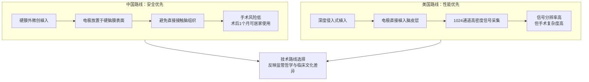
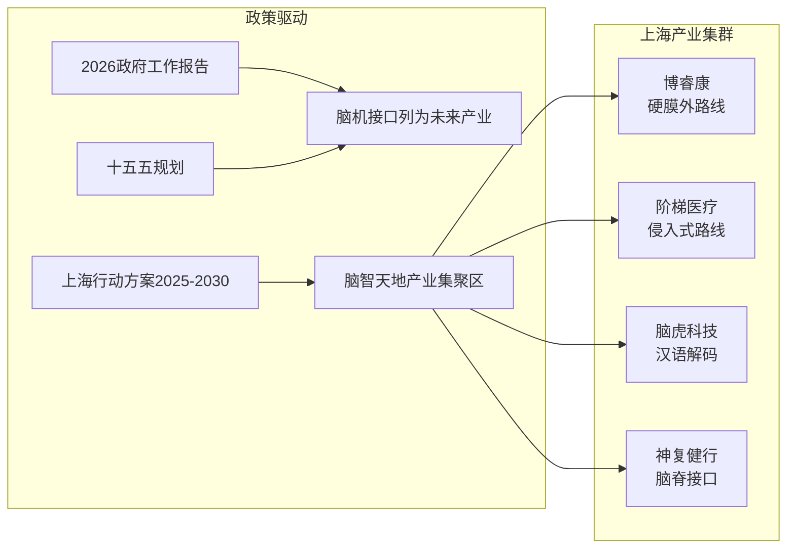
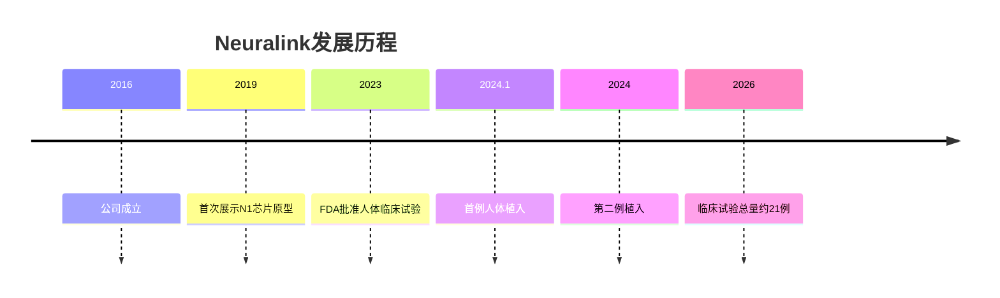
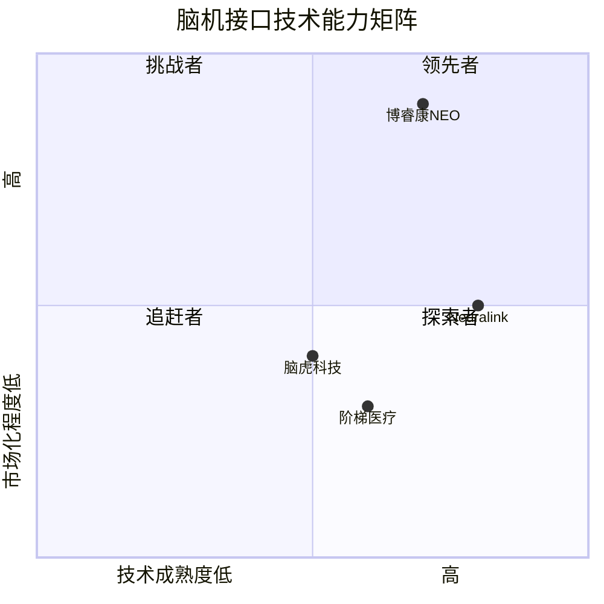
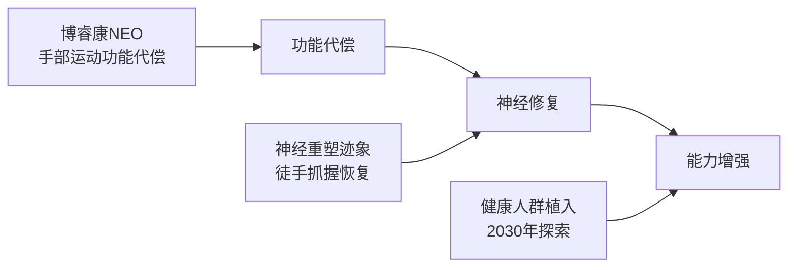

# 侵入式脑机接口技术路线与产业格局分析

> 博睿康NEO"全球首证"背后的中美竞赛

---

## 摘要

2026年3月13日，博睿康医疗科技（上海）有限公司研发的植入式脑机接口手部运动功能代偿系统NEO，正式获得国家药监局第三类医疗器械注册证，成为**全球首款获批上市的侵入式脑机接口产品**。本文从技术路线对比、产业格局分析两个维度，深入解读这一里程碑事件背后的中美脑机接口竞赛。

---

## 一、技术路线之争：安全优先 vs 性能优先

### 1.1 两条路线的本质差异

### 1.2 博睿康NEO技术方案

| 维度 | 博睿康NEO | Neuralink N1 |
|------|-----------|--------------|
| **植入方式** | 硬膜外微创 | 深度侵入式 |
| **电极位置** | 硬脑膜表面 | 脑皮层内部 |
| **信号通道** | 未公开（较低） | 1024通道 |
| **手术复杂度** | 接近常规神经外科 | 需专用手术机器人 |
| **安全性** | 高（无脑组织损伤） | 中（有电极脱落风险） |
| **信号质量** | 中等 | 高 |
| **术后恢复** | 1个月居家使用 | 需长期随访 |

### 1.3 临床数据对比

**博睿康NEO临床成果：**
- 完成手术：36例
- 多中心确证性临床：32例
- 成功率：100%（所有受试者实现脑控抓握）
- 意外发现：部分患者出现神经重塑，徒手抓握能力自发恢复

**Neuralink临床挑战：**
- 首例植入患者Noland Arbaugh出现半数电极丝回缩脱落
- 需通过软件算法补偿硬件缺陷
- 长期生物相容性仍待验证

---

## 二、产业格局：中国"加速度"与美国"深积累"

### 2.1 中国脑机接口产业地图

### 2.2 上海：全球脑机接口创新策源地

| 指标 | 数据 |
|------|------|
| 企业数量 | 近60家 |
| 技术路线覆盖 | 侵入式、半侵入式、非侵入式全覆盖 |
| 全球临床试验企业 | 10家（中美各5家，上海占3席） |
| 2025年融资占比 | 全国36.4%（案例数）、53.7%（金额） |

### 2.3 中国头部企业技术布局

| 企业 | 技术路线 | 核心突破 | 最新进展 |
|------|----------|----------|----------|
| **博睿康** | 硬膜外半侵入式 | 全球首证 | 2026.3获批上市 |
| **阶梯医疗** | 深度侵入式 | 256通道无线植入 | 2026年初完成首例临床，阿里领投5亿元 |
| **脑虎科技** | 侵入式 | 全球首例汉语实时解码 | 填补声调语言脑机解码空白 |
| **神复健行** | 脑脊接口 | "三合一"技术 | 进入FDA"突破性疗法"通道 |

### 2.4 Neuralink：美国路线的代表

**Neuralink技术特点：**
- N1芯片：1024通道高密度信号采集
- 手术机器人：自动化立体定位仪，探头直径40微米
- 电极丝：比头发丝还细的柔性电极线
- 目标：2030年探索向健康人群植入

---

## 三、核心问题：首证意味着什么？

### 3.1 "领跑"还是"抢得先手"？

**结论：中国在"安全优先"路线上取得商业化先手，但核心技术仍有差距。**

### 3.2 差距在哪里？

| 维度 | 中国 | 美国 | 差距评估 |
|------|------|------|----------|
| **核心硬件** | 依赖进口 | 自主可控 | ⚠️ 较大 |
| **底层算法** | 快速追赶 | 领先 | ⚠️ 中等 |
| **产业链自主** | 部分环节薄弱 | 完整 | ⚠️ 较大 |
| **监管效率** | 高（一企一策） | 中等 | ✅ 领先 |
| **临床数据** | 积累中 | 较多 | ⚠️ 中等 |
| **商业化进程** | 已获批上市 | 临床试验阶段 | ✅ 领先 |

---

## 四、投资与风险分析

### 4.1 资本热度

**2025年上海脑机接口融资：**
- 融资案例：占全国36.4%
- 融资金额：占全国53.7%

**阶梯医疗战略融资（2026.3）：**
- 金额：5亿元
- 领投：阿里巴巴
- 跟投：国投创合、腾讯、启明创投、礼来亚洲基金
- 意义：阿里与腾讯首次在脑机接口领域共同下注

### 4.2 风险提示

| 风险类型 | 具体表现 |
|----------|----------|
| **技术风险** | 长期生物相容性未知、信号稳定性待验证 |
| **监管风险** | 各国审批标准不一、伦理审查趋严 |
| **市场风险** | 商业化路径不清晰、支付体系未建立 |
| **竞争风险** | 技术路线可能被颠覆、先发优势不稳固 |

---

## 五、未来展望

### 5.1 技术演进方向

### 5.2 产业竞争格局预测

| 时间节点 | 中国 | 美国 |
|----------|------|------|
| **2026** | 博睿康NEO上市，阶梯医疗大规模临床 | Neuralink继续临床试验 |
| **2027-2028** | 多家企业获批，产业链逐步完善 | 可能获批上市 |
| **2029-2030** | 形成完整产业生态，出海竞争 | 探索健康人群市场 |

---

## 六、结论

博睿康NEO的"全球首证"是中国脑机接口产业的重要里程碑，但更准确地说，这是在**"安全优先"技术路线上的率先突破**，而非全面领先。

**核心判断：**

1. **技术路线选择**：中国选择安全优先，美国选择性能优先，各有优劣
2. **商业化进程**：中国凭借监管效率取得先手，但技术积累仍有差距
3. **产业基础**：上海已形成产业集群，但核心硬件仍需突破
4. **投资热度**：资本涌入加速发展，但需警惕泡沫风险

**对科技爱好者的启示：**

脑机接口正处于从实验室走向临床的关键转折点。中国企业在特定路线上取得突破，但这场关于大脑的竞赛才刚刚开始。未来5-10年，技术路线的竞争、监管政策的博弈、产业链的完善，将共同决定这场竞赛的最终赢家。

---

## 参考资料

1. 观察者网《"全球首证"背后：一场关于大脑的中美竞赛悄然提速》2026-04-02
2. 国家药监局第三类医疗器械注册公告 2026-03-13
3. 上海市脑机接口未来产业培育行动方案（2025-2030年）
4. Neuralink官方公开资料

---

*报告生成时间：2026-04-06*
*报告类型：技术路线与产业格局分析*
*目标受众：科技爱好者*