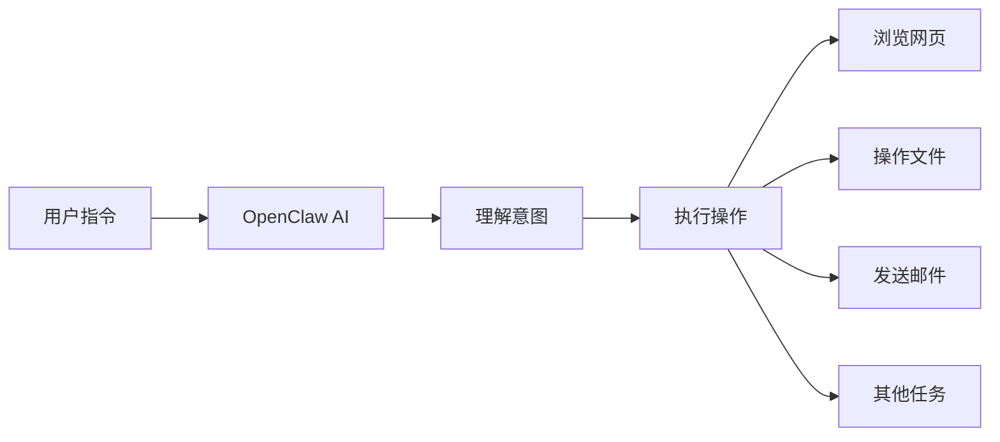
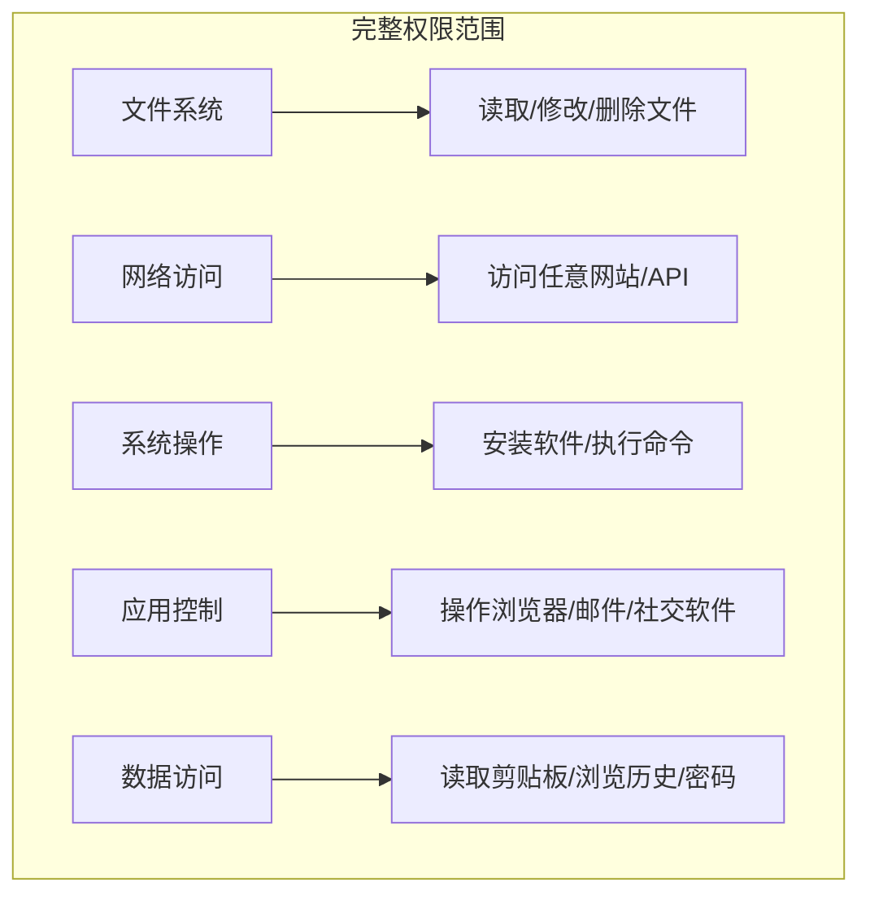
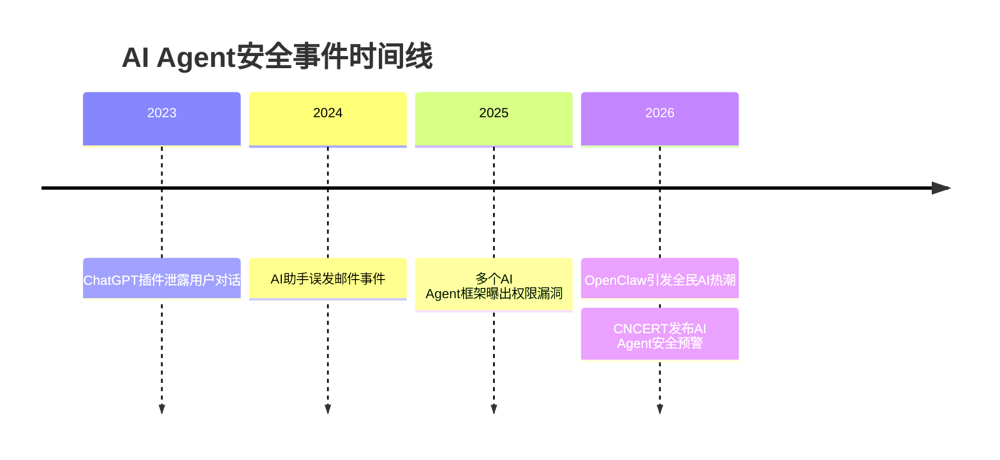
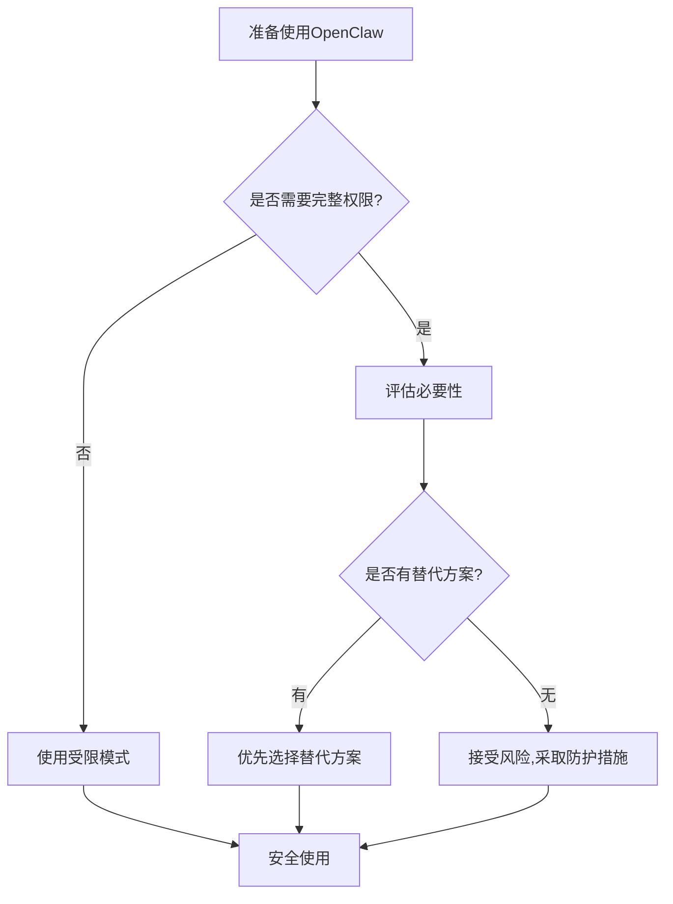
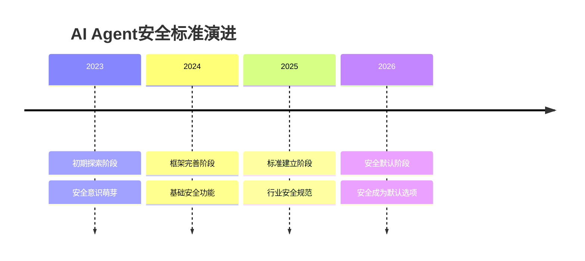
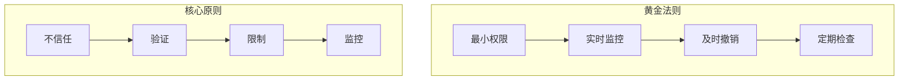

# 完整权限交给AI，你在冒什么险？OpenClaw安全指南

> 普通用户必读的AI Agent安全防护手册

---

## 摘要

2026年伊始，开源AI智能体OpenClaw（又称"小龙虾"）在全球引发全民AI热潮，几周内成为GitHub星标数最高的开源项目。然而，当用户将完整权限交给AI时，是否真正了解背后的风险？本文从安全风险科普和用户防护指南两个维度，帮助普通用户建立正确的AI安全意识。

---

## 一、OpenClaw是什么？为什么这么火？

### 1.1 OpenClaw简介

OpenClaw是一个开源的AI智能体（AI Agent）框架，让用户可以通过自然语言指令，让AI自动完成各种电脑操作：

### 1.2 为什么火爆？

| 原因 | 说明 |
|------|------|
| **门槛低** | 自然语言指令，无需编程知识 |
| **功能强** | 可完成复杂的多步骤任务 |
| **开源免费** | GitHub开源，各大云厂商支持 |
| **政策鼓励** | 多地政府出台AI产业扶持政策 |

---

## 二、核心风险：当AI拥有"完整权限"

### 2.1 什么是"完整权限"？

### 2.2 五大核心风险

#### 风险一：数据泄露

| 场景 | 后果 |
|------|------|
| AI读取敏感文件 | 个人隐私、财务信息泄露 |
| AI访问浏览历史 | 上网习惯、账号信息暴露 |
| AI读取剪贴板 | 复制的密码、验证码泄露 |

#### 风险二：恶意操作

| 场景 | 后果 |
|------|------|
| AI被诱导执行恶意命令 | 删除重要文件、安装恶意软件 |
| AI访问钓鱼网站 | 账号被盗、资金损失 |
| AI发送恶意邮件 | 社交工程攻击、诈骗 |

#### 风险三：权限滥用

| 场景 | 后果 |
|------|------|
| AI超出任务范围操作 | 误删文件、误发信息 |
| AI访问不该访问的网站 | 隐私泄露、法律风险 |
| AI修改系统设置 | 系统不稳定、安全漏洞 |

#### 风险四：不可逆后果

| 场景 | 后果 |
|------|------|
| AI删除文件 | 数据丢失，难以恢复 |
| AI发送信息 | 信息发出无法撤回 |
| AI执行转账 | 资金损失，追回困难 |

#### 风险五：长期隐患

| 场景 | 后果 |
|------|------|
| AI记录操作日志 | 隐私持续泄露 |
| AI学习用户习惯 | 行为模式被掌握 |
| AI连接云端 | 数据上传至第三方 |

---

## 三、真实案例：AI Agent安全事件

### 3.1 已知风险场景

### 3.2 典型风险模式

| 模式 | 描述 | 危险程度 |
|------|------|----------|
| **提示词注入** | 攻击者通过特殊指令诱导AI执行恶意操作 | ⚠️⚠️⚠️ 高 |
| **权限越界** | AI超出用户预期范围操作 | ⚠️⚠️ 中高 |
| **数据外泄** | AI将敏感数据发送到外部服务器 | ⚠️⚠️⚠️ 高 |
| **供应链攻击** | 恶意插件/扩展植入后门 | ⚠️⚠️⚠️ 高 |

---

## 四、普通用户安全指南

### 4.1 使用前：评估风险

**评估清单：**

| 问题 | 是 | 否 |
|------|-----|-----|
| 这个任务真的需要AI自动完成吗？ | ⬜ 重新考虑 | ⬜ 继续 |
| 是否可以用更安全的方式完成？ | ⬜ 选择替代方案 | ⬜ 继续 |
| 我是否了解AI会执行哪些操作？ | ⬜ 继续 | ⬜ 先了解 |
| 我是否准备好了应对意外情况？ | ⬜ 继续 | ⬜ 先准备 |

### 4.2 使用中：实时监控

**关键监控点：**

| 监控项 | 方法 | 异常处理 |
|--------|------|----------|
| 文件操作 | 查看AI操作日志 | 立即停止 |
| 网络访问 | 监控网络请求 | 断开网络 |
| 系统命令 | 检查执行记录 | 终止进程 |
| 数据传输 | 查看上传内容 | 撤销权限 |

### 4.3 使用后：安全检查

**检查清单：**

- [ ] 检查AI操作日志，确认无异常
- [ ] 检查文件系统，确认无意外修改
- [ ] 检查网络记录，确认无异常连接
- [ ] 检查剪贴板，清除敏感内容
- [ ] 检查已登录账号，确认无异常登录

---

## 五、安全防护最佳实践

### 5.1 权限最小化原则

**实践建议：**

| 原则 | 具体做法 |
|------|----------|
| **按需授权** | 只授予完成任务所需的最小权限 |
| **临时授权** | 任务完成后立即撤销权限 |
| **隔离环境** | 在虚拟机或沙箱中运行AI |
| **敏感保护** | 禁止AI访问密码、银行等敏感数据 |

### 5.2 数据保护措施

| 措施 | 操作方法 |
|------|----------|
| **敏感文件隔离** | 将敏感文件存放在AI无法访问的目录 |
| **密码管理** | 使用独立密码管理器，禁止AI访问 |
| **剪贴板清理** | 使用后立即清除剪贴板内容 |
| **浏览历史清理** | 定期清理，或使用隐私模式 |

### 5.3 网络安全设置

| 设置 | 建议 |
|------|------|
| **防火墙规则** | 限制AI只能访问必要的网站 |
| **DNS过滤** | 屏蔽已知恶意域名 |
| **代理监控** | 通过代理监控所有网络请求 |
| **HTTPS强制** | 确保所有连接使用加密 |

---

## 六、行业监管与安全标准

### 6.1 国家安全预警

2026年，国家互联网应急中心（CNCERT）和工信部发布安全预警：

| 预警内容 | 说明 |
|----------|------|
| **安全正在从"可选项"变成"默认项"** | 国产AI Agent框架已改进安全性 |
| **安全底线是长期健康发展的前提** | AI Agent方向正确，但需守住安全底线 |
| **用户安全意识需提升** | 普通用户需了解AI权限风险 |

### 6.2 安全标准演进

---

## 七、常见问题解答

### Q1：OpenClaw会偷我的数据吗？

**A：** OpenClaw本身是开源项目，代码公开可审计。但风险来自：
- 你授予的权限范围
- 你使用的第三方插件
- 你连接的云端服务

**建议：** 只从官方渠道下载，仔细审查插件权限。

### Q2：如何知道AI在做什么？

**A：** 大多数AI Agent框架提供操作日志功能：
- 查看实时操作记录
- 设置操作确认提示
- 启用详细日志模式

### Q3：发现异常操作怎么办？

**A：** 立即执行以下步骤：
1. **终止进程** - 停止AI运行
2. **断开网络** - 防止数据外泄
3. **检查系统** - 查看是否有异常修改
4. **修改密码** - 如果密码可能泄露
5. **报告问题** - 向开发者或安全机构报告

### Q4：普通用户如何选择安全的AI工具？

**A：** 选择时考虑以下因素：

| 因素 | 安全选择 |
|------|----------|
| **开源vs闭源** | 优先选择开源，代码可审计 |
| **权限控制** | 选择提供细粒度权限控制的工具 |
| **数据存储** | 优先选择本地处理，避免云端上传 |
| **安全认证** | 查看是否有安全认证或审计报告 |
| **社区评价** | 查看用户反馈和安全讨论 |

---

## 八、总结：安全使用AI的黄金法则

### 记住这五句话：

1. **权限越小越安全** - 只给AI完成任务所需的最小权限
2. **监控不能少** - 实时关注AI的操作行为
3. **敏感要隔离** - 密码、银行等敏感信息禁止AI访问
4. **用完即撤销** - 任务完成后立即收回权限
5. **异常即停止** - 发现任何异常立即终止操作

---

## 参考资料

1. 观察者网《完整权限交给AI，OpenClaw用户知道自己正在冒什么险吗？》2026-03-27
2. 国家互联网应急中心（CNCERT）安全预警
3. 工信部AI Agent安全指导意见

---

*报告生成时间：2026-04-06*
*报告类型：安全风险科普 + 用户防护指南*
*目标受众：普通用户*